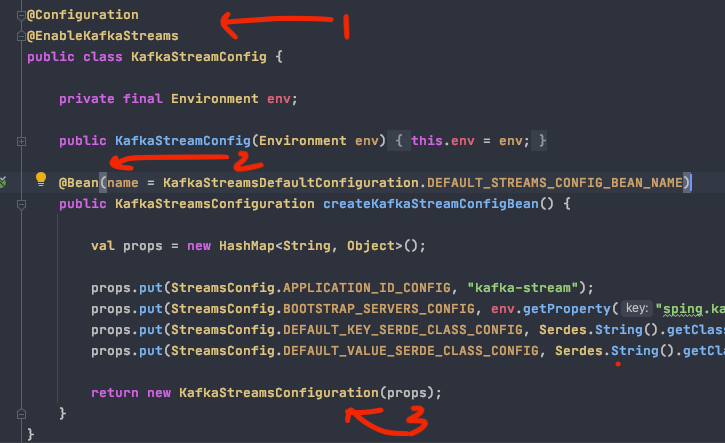
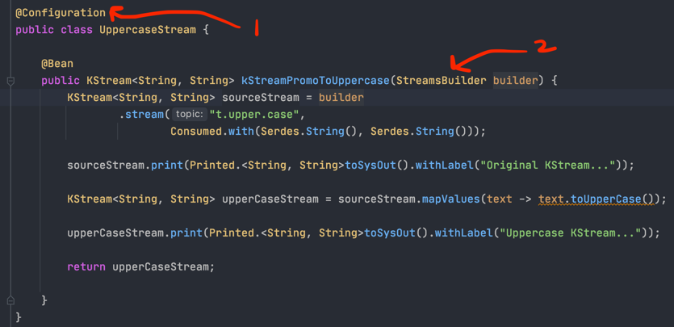

*Spring-boot with kafka streams sample application*
---------------------------------------------------

Create a configuration class
~~~~~~~~~~~~~~~~~~~~~~~~~~~

1. Create a configuration and enable kafka stream using the @EnableKafkaStreams annotation.

2. Configure the @Bean with a unique name and provide the kafka properties.

3. Create a KafkaStreamsConfiguration properties bean.

Create a Topology using the KStream as a Bean
~~~~~~~~~~~~~~~~~~~~~~~~~~~~~~~~~~~~~~~~~~~~~

1. A configuration class is declared
2. StreamsBuilder is injected

How to run the sample app?
~~~~~~~~~~~~~~~~~~~~~~~~~~

Start docker compose

`>docker-compose -d up`

Create a topic if not already created

`>docker exec -it kafka /opt/kafka/bin/kafka-topics.sh --bootstrap-server localhost:9092 --create --topic t.upper.case --partitions 3 --replication-factor 1`

Check if the topic gets created or not

`>docker exec -it kafka /opt/kafka/bin/kafka-topics.sh --bootstrap-server kafka:9092 --list`

Start the spring-boot application

Go to the console and start sending the message in lowercase

`docker exec -it kafka /opt/kafka/bin/kafka-console-producer.sh --broker-list kafka:9092 --topic t.upper.case`

