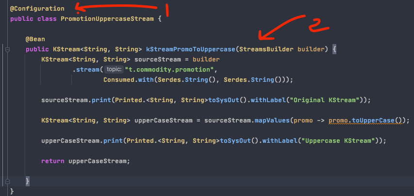

**Spring boot with kafka streams sample application
**

To create a streaming consumer using spring boot, you would need to crate a configuration class

1. Create a configuration and enable kafka stream using the @EnableKafkaStreams annotation.

2. Configure the @Bean with a unique name and provide the kafka properties.

3. Create a KafkaStreamsConfiguration properties bean.

image::image-2020-11-25-13-23-43-891.png[]

Create a Topology using the KStream as a Bean

1. A configuration class is declared
2. StreamsBuilder is injected

